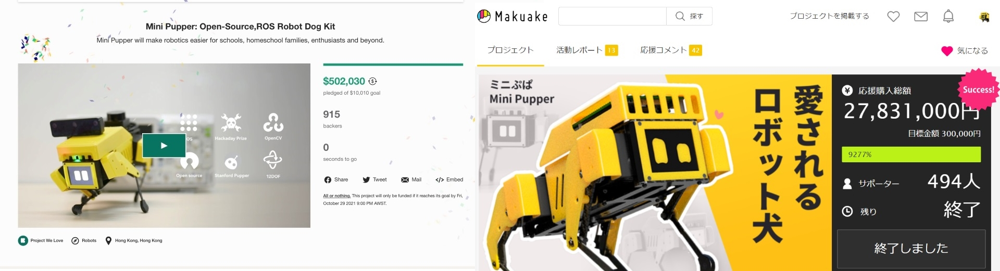

# Mini Pupper - ROS, OpenCV, Open-source, Pi Robot Dog

Online channel: [Discord](https://discord.gg/xJdt3dHBVw), [Facebook](https://www.facebook.com/groups/716473723088464), [YouTube](https://www.youtube.com/channel/UCqHWYGXmnoO7VWHmENje3ug/featured), [Twitter](https://twitter.com/LeggedRobot)

Document: https://minipupperdocs.readthedocs.io/en/latest/index.html

Main GitHub repository: https://github.com/mangdangroboticsclub/mini_pupper

Mini Pupper will make robotics easier for schools, homeschool families, enthusiasts and beyond.

- ROS: support ROS SLAM&Navigation robot dog at low-cost price, endorsed by ROS.
- OpenCV: support OpenCV official OAK-D-Lite 3D camera module, endorsed by OpenCV.
- Open-source: DIY and custom what you want, won a HackadayPrize!
- Raspberry Pi: it’s super expandable, endorsed by Raspberry Pi.

| Navigation | Object Detection |
| --- | --- |
|  |  |

## Mini Pupper

Mini Pupper was showed both on the first page of Kickstarter and Makuake campaign platform, and got many backers!  

## Mini Pupper 2

[Mini Pupper 2](https://www.kickstarter.com/projects/336477435/mini-pupper-2-open-source-ros2-robot-kit-for-dreamers) has launched on Kickstarter!  
https://www.kickstarter.com/projects/336477435/mini-pupper-2-open-source-ros2-robot-kit-for-dreamers  

